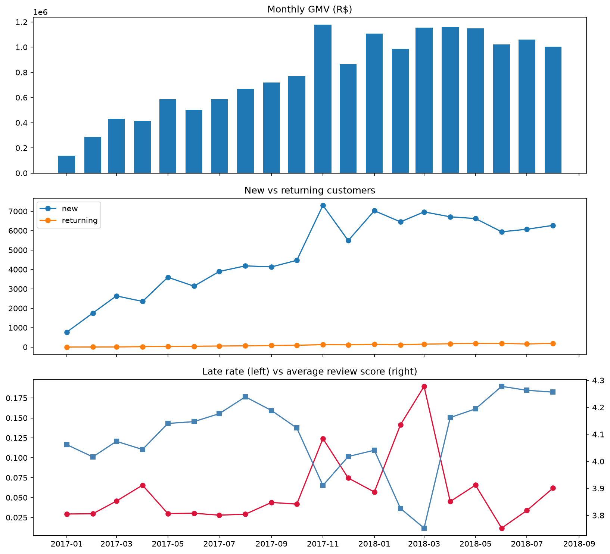
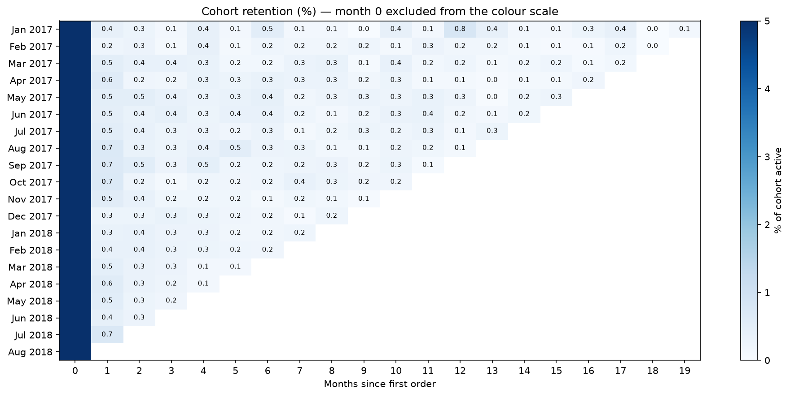

# Findings — Olist Marketplace Health

Analysis on the `main_marts` models built with dbt + DuckDB. Every figure is reproducible
from `notebooks/01_Analysis.ipynb`. Metric definitions are in `metrics.md`; data defects are
in `data_quality_log.md`.

**Analysis window: 2017-01-01 to 2018-08-31 — 20 complete months.**

Sep–Dec 2016 is a pilot period: 4 orders, then 324, then Nov 2016 absent entirely, then 1.
Sep–Oct 2018 is the data collection stopping mid-flight: 20 orders across both months, no
delivery outcomes recorded, and no item rows at all in October. Including either end
produces a chart that appears to show a business collapsing; what it shows is the dataset's
boundary. The window rule is "months where collection is complete" — applied without
reference to whether the numbers look favourable.

---

## 1. Growth stopped five months before the data ends

| | Orders / month |
|---|---|
| Jan 2017 | 800 |
| Mar 2018 | 7,211 — peak |
| Apr 2018 | 6,939 |
| May 2018 | 6,873 |
| Jun 2018 | 6,167 |
| Jul 2018 | 6,292 |
| Aug 2018 | 6,512 |

2017 delivered roughly 9x growth. From March 2018 the business is flat to slightly
declining for five consecutive months, holding around R$1.0–1.15M GMV per month.

**Average order value never moved.** It sits between R$145 and R$175 across the entire
window with no trend, against an overall AOV of about R$159. Every rupee of GMV growth came
from *more orders*, not larger baskets — growth is purely an acquisition story.

November 2017 is the single best month at 7,544 orders and R$1.18M — Black Friday. December
falls back to 5,673. The spike did not carry forward.

---

## 2. There is no retention to speak of

**2,997 of 96,096 customers ever placed a second order — 3.1%.**

Monthly, new customers climb from 764 to roughly 7,000 while returning customers rise from
0 to 189 and stay flat against the axis. The business acquires a new cohort every month and
keeps almost none of it.

This single fact governs how everything else should be read: no loyalty base, no
compounding, and effectively no lifetime value beyond the first order.

---

### 2.1 Cohort retention — the shape, and a censoring trap

`fct_cohort_retention` holds one row per (cohort month, months since joining), for the 20
monthly cohorts in the window. The table is a triangle by construction: a cell exists only
where the month has actually elapsed, so an un-elapsed month is blank rather than 0%.

**The retention curve**, averaged across cohorts and weighted by cohort size:

| Months since first order | 1 | 2 | 3 | 4 | 6 | 9 | 12 | 15 |
|---|---|---|---|---|---|---|---|---|
| % of cohort active | 0.51 | 0.34 | 0.26 | 0.26 | 0.23 | 0.17 | 0.18 | 0.17 |

A shallow decay over three months, then a flat tail at 0.15–0.25% that persists for sixteen
months without trending to zero. That shape is the signature of **occasional, need-driven
buying rather than habit**: a small constant fraction returns at any given month, unrelated
to how recently they last bought.

**The practical consequence:** there is no post-purchase window to act in. Month 1 and month
11 look nearly identical, so a lifecycle campaign timed to a decay curve would be aimed at a
curve that does not exist here.

**Customer quality is not deteriorating.** Measured at a fixed three-month horizon so every
cohort is compared at the same age, retention is 1.09% on average with a range of 0.63–1.50%
and no trend across seventeen cohorts.

This correction matters. The uncensored version — "what share of each cohort ever returned" —
falls from 4.84% for Jan 2017 to 0.72% for Jul 2018 and looks like an 85% collapse. It is
entirely an artefact: the January cohort has had nineteen months to return and the July
cohort one. **Any lifetime metric is censored by how long each group has existed; comparing
them across cohorts without fixing the window compares age, not behaviour.**

**One cohort is genuinely different.** December 2017 shows the weakest month-1 retention of
2017–18 at 0.26%, roughly half its neighbours — consistent with Christmas gift buyers
purchasing for someone else. November 2017, the Black Friday cohort, is unremarkable at
0.55%, so discounting did not visibly damage cohort quality.

At these rates individual cells are single-digit customer counts — the Jan 2017 cohort's
apparent month-12 spike of 0.79% is six people out of 764. Only the aggregate curve and the
fixed-horizon comparison should be interpreted.

---

## 3. The overall late rate hides a nineteen-fold range

The headline is **6.77% of delivered orders arriving after the promised date** — 6,535 of
96,476 orders where the outcome is known. Monthly, that ranges from **1% (Jun 2018) to 19%
(Mar 2018)**, and review scores track inversely with it across all twenty months.

Note that 6.77% and "a typical month" are different questions. 6.77% correctly answers
*what share of orders were late*. The unweighted mean of the monthly rates is higher,
inflated by a pilot month containing one order, which happened to be late. **Where the
spread is the story, a single number is a lie of omission** — so the range is reported
rather than a central value.

The same distinction applies across sellers: the order-weighted rate is 6.77% while the
mean of per-seller rates is 6.91%. That 0.14-point gap is consistent with smaller sellers
performing marginally worse, but it is small and should not be leaned on.

Two of the spikes have different characters. November 2017 is Black Friday: a known,
plannable, single-month event. **February and March 2018 are two consecutive months far
worse than Black Friday with no seasonal explanation, and they coincide exactly with the
point order growth stalled.** That is an open question this dataset cannot answer.

---

## 4. Late delivery destroys reviews. It does not measurably cost repeat purchases.

### The review effect is very large

| | On time | Late |
|---|---|---|
| Orders | 89,941 | 6,535 |
| Average review score | 4.29 | **2.27** |
| 1–2 star rate | 9% | **62%** |
| 5-star rate | 62% | 17% |
| Average delivery time | 10.9 days | **33.9 days** |

Nearly two thirds of late orders receive one or two stars, against 9% of on-time orders —
**seven times the rate**. And late orders are not marginally late: 33.9 days against 10.9,
so the customer waited roughly three weeks beyond an already generous estimate.

### The effect scales with how late — and the damage is front-loaded

| Lateness | Orders | Avg review | Change |
|---|---|---|---|
| On time | 89,941 | **4.29** | — |
| 1–3 days late | 1,870 | **3.29** | **−1.00** |
| 4–7 days late | 1,802 | 2.10 | −1.19 |
| 8–14 days late | 1,479 | 1.67 | −0.43 |
| 15+ days late | 1,384 | 1.72 | +0.05 |

**Being merely one to three days late costs a full star.** That is the most actionable
number in this analysis: an intervention should target eliminating small misses, not only
the catastrophic tail. The flattening at 1.67–1.72 is a floor effect — the scale stops at 1,
so further lateness has nowhere left to show.

A monotonic dose-response relationship is meaningfully stronger evidence than a two-group
comparison, because a confounder would have to correlate with the *degree* of lateness
rather than merely its presence.

### The repeat-purchase effect is small and probably immaterial

Taking each customer's **first** order and asking whether they ever returned:

| First order was | Customers | Returned | Repeat rate |
|---|---|---|---|
| On time | 86,909 | 2,716 | **3.13%** |
| Late | 6,345 | 161 | **2.54%** |

A two-proportion z-test puts the difference outside what chance comfortably explains, but it
is 0.6 percentage points in absolute terms against a 3% baseline, and with 93,254 customers
even trivial differences reach significance. **Statistically detectable, practically
negligible.**

### What this means — and it is not the expected answer

The intuitive story is that late delivery angers customers, they do not return, and the cost
is lost future revenue. **The data does not support that chain.** Late delivery makes
customers furious — 62% one or two stars — but they were largely not returning anyway. Only
3% of anyone returns. There is no loyalty to destroy.

**The cost of late delivery therefore cannot be quantified as lost repeat revenue from this
dataset.** It sits elsewhere, and the three plausible channels are:

1. **Acquisition damage.** Late orders produced roughly 4,050 one- and two-star reviews in
   this window, of which about 3,450 are in excess of what the on-time rate would have
   produced. In a business whose only growth engine is new customers, public review scores
   are an acquisition input. Quantifying this needs traffic and conversion data the dataset
   does not contain.
2. **Operational cost.** Support contacts, refunds, disputes, re-shipments. Not in the data.
3. **Seller churn.** The average seller is active only 5.3 of 24 months. Whether late
   delivery predicts a seller leaving the platform *is* testable with `fct_seller_monthly`,
   and is the next thing worth doing.

For scale, if lateness were eliminated entirely *and* the relationship were fully causal,
the overall 1–2 star rate would fall from about 12.6% to 9.0% — a 3.6 point move, or a 29%
reduction in bad reviews. Note that this is an order of magnitude smaller than the 53-point
within-group gap, because the gap applies only to the 6.8% of orders that are late. **A
within-group difference must be multiplied by the group's share before it is a business
impact.**

---

## 5. A definitional defect found by cross-checking — and fixed

The two-group comparison and the dose-response bands disagreed on the split by 1,292 orders.
`is_late` was defined as `delivered_at > estimated_delivery_at`, and `estimated_delivery_at`
is a date, i.e. midnight — so an order delivered at 14:00 on the promised day was counted as
late, while `date_diff` in days correctly reported zero. The dose-response table was built on
`delay_days` and was always correct, which is why the discrepancy was findable at all.

**Decision: an order is late when it arrives on a later calendar day than promised.** The
promise made to the customer is a date, not a timestamp. `is_late` is now
`date_diff('day', estimated, delivered) > 0`.

**The data supports that decision after the fact.** The 1,292 reclassified orders average a
review score of roughly 4.1 — close to the on-time group's 4.29 and far from the late group's
2.27. Adding them to the on-time group left its average unmoved at 4.29. Customers who
received their order on the promised day behaved like on-time customers.

| | Before | After |
|---|---|---|
| Late orders | 7,827 | 6,535 |
| Late rate | 8.11% | **6.77%** |
| Seller-average late rate | 8.42% | **6.91%** |
| Late group avg review | 2.57 | **2.27** |
| Late group 1–2 star rate | 54% | **62%** |

Note the direction: correcting the definition made the measured effect **larger**.
Measurement error dilutes an effect towards zero, so fixing it sharpens the signal. It also
halved the weighted/unweighted gap across sellers, because definitional noise distorts small
groups most. The side benefit is that the new expression uses raw column names rather than a
same-SELECT alias, which makes the model portable beyond DuckDB.

---

## 6. What this analysis cannot claim

The data is observational. Orders are not randomly assigned to be late, so the on-time/late
comparison includes the effect of everything that *causes* lateness:

| Confounder | Independent path to a bad review |
|---|---|
| Geography | Remote states are slower *and* may rate differently |
| Product weight and size | Heavy items ship slowly *and* arrive damaged or oversized |
| Category | Furniture is slow *and* more disappointing on arrival |
| Seller quality | A careless seller packs badly *and* dispatches slowly |
| Multi-seller orders | Several warehouses means more chances of lateness *and* of error |
| Seasonal load | Peaks strain logistics *and* attract different customers |

The comparison is therefore an **association**, not a causal effect, and the dose-response
curve strengthens it without establishing causation. Three checks are available and not yet
done:

- Compare within state and within category, to rule out geography and product mix.
- Test whether heavy items receive worse reviews *even when delivered on time* — the direct
  test of whether weight is a confounder rather than a link in the chain.
- Control for monthly order volume, since the monthly association could be driven by load.

Establishing causation requires an experiment. That design is section 4 of the project plan.

---

## Open questions for someone inside the business

1. What happened in February–March 2018? Two months far worse than Black Friday, at exactly
   the point growth stalled.
2. Was the March 2018 plateau a demand ceiling, a deliberate reduction in acquisition spend,
   or a consequence of the delivery failures immediately preceding it?
3. Is a 3.1% repeat rate normal for this category in this market? The dataset cannot say.

---

## Still to do

- Cohort retention table and heatmap (`fct_cohort_retention`)
- Conditional association: late-delivery effect within state and category
- Weight-as-confounder test on on-time orders only
- Seller churn against late rate, using `fct_seller_monthly`